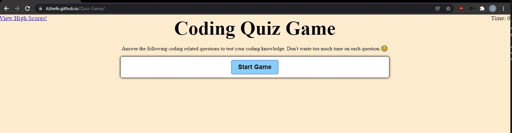

# Quiz-Game

* Quiz game project consisted of HTML, CSS, and Javascript. 
* The user will answer a series of coding related questions. 
* If the user get the right answer they are told Correct! 
* A next button appears so they can move forward through the quiz.
* If the user gets the answer wrong, 5 seconds is taken from the remaining time. 
* At the end of the 5 questions the time remaining is captured as the users score. 
* They can then link over to the high scores page to see a stack rank of participants. 

## Acceptance Criteria

```
GIVEN I am taking a code quiz
WHEN I click the start button
THEN a timer starts and I am presented with a question
WHEN I answer a question
THEN I am presented with another question
WHEN I answer a question incorrectly
THEN time is subtracted from the clock
WHEN all questions are answered or the timer reaches 0
THEN the game is over
WHEN the game is over
THEN I can save my initials and my score
```

## Link to deployed page:

[Quiz Game Page](https://itzhefe.github.io/Quiz-Game/index.html)

## Screen-shots:

### Quiz Game Main Page:



### Quiz question prompts:


### High Scores Page:

